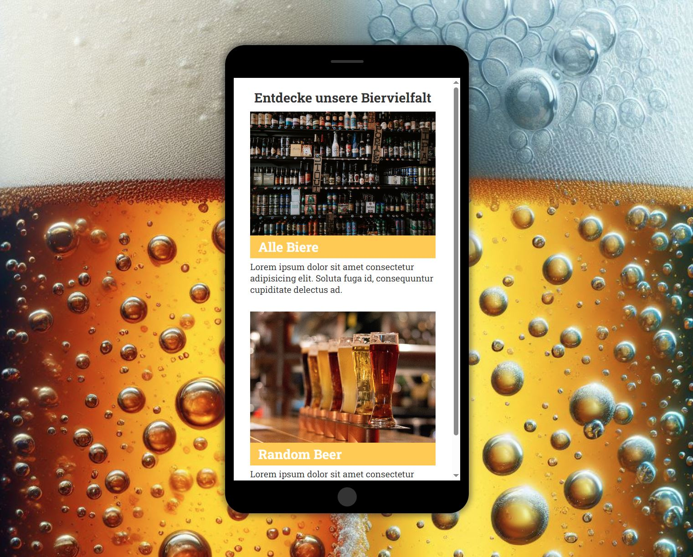
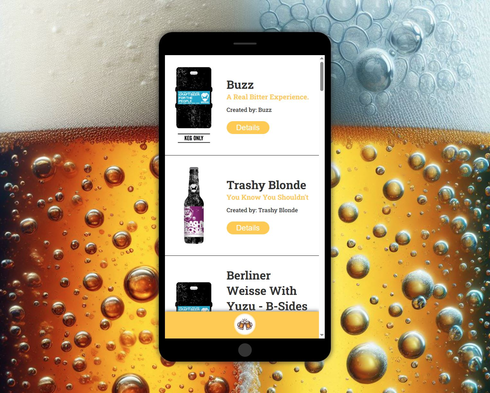
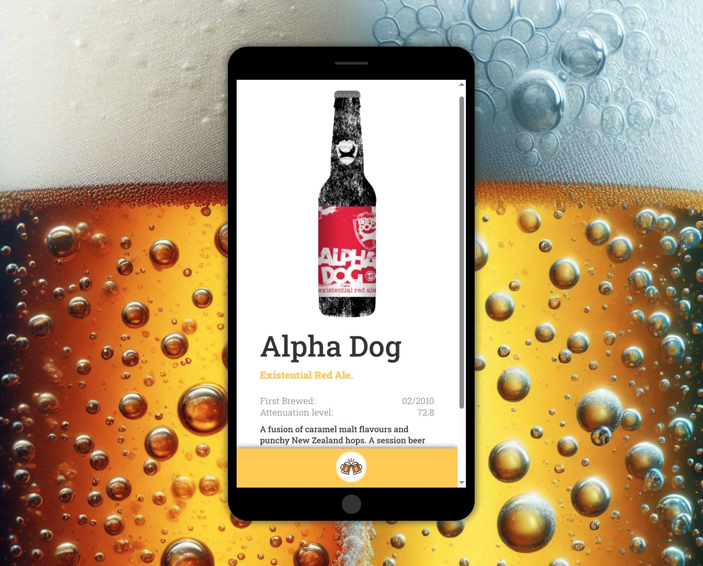

# Beer API – REACT-Projekt

## Beschreibung

Dieses REACT-Projekt wurde im Rahmen eines Coding-Bootcamps bei supercode.de erstellt.
Es handelt sich um eine Bier-Website in einer Mobile-Ansicht, bei der die Biere per API gefetcht werden.

### Die Anwendung bietet folgende Möglichkeiten

- Alle Biere in einer Übersichtsseite als Liste anzeigen lassen
- Biere in einer Detailansicht mit weiteren Infos anzeigen lassen
- Ein Random Bier in einer Detailansicht anzeigen lassen

## Tools/Technologien

- HTML5
- CSS
- REACT

## Screenshot

### Ansichten der Webseite

## Netlify Live Vorschau

Du findest eine Live Vorschau auf Netlify: [Netlify Live Vorschau](https://reactjs-beer-api-rainer-busch.netlify.app)

## GitHub Repository

Du findest das gesamte Projekt auf GitHub: [GitHub Repository](https://github.com/w1tch3r-code/reactjs_beer_api)

## Anmerkungen

- Dieses Projekt wurde im Rahmen eines Coding-Bootcamps bei supercode.de erstellt.
- Die Anwendung ermöglicht eine einfache und schnelle Anzeige verschiedener Biere, die per API gefetcht werden.
- Die README.md-Datei dient auch als Bewerbungsunterlage und präsentiert meine Fähigkeiten in der Webentwicklung.
